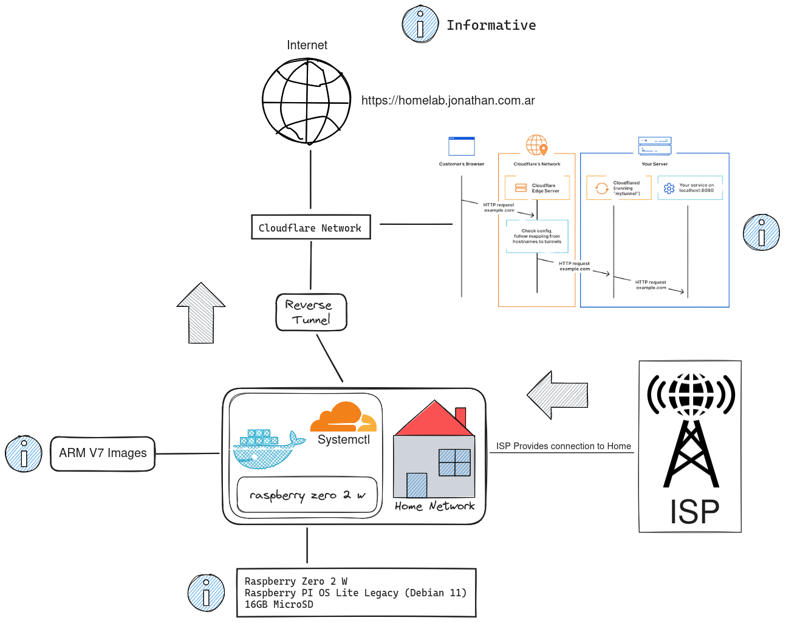
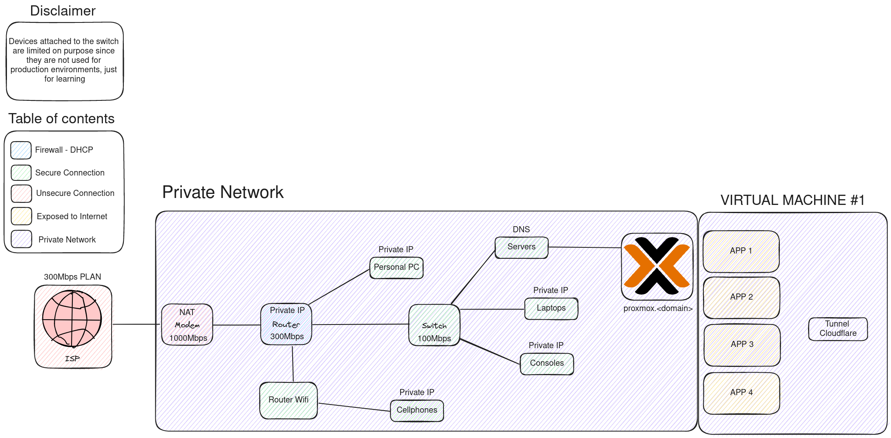
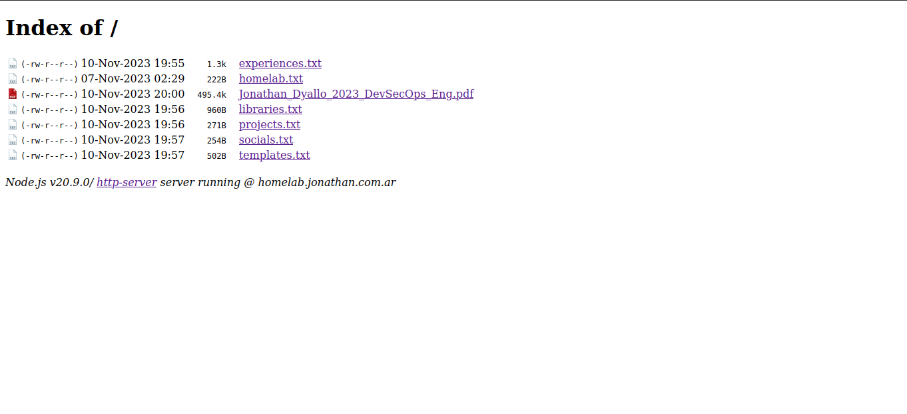
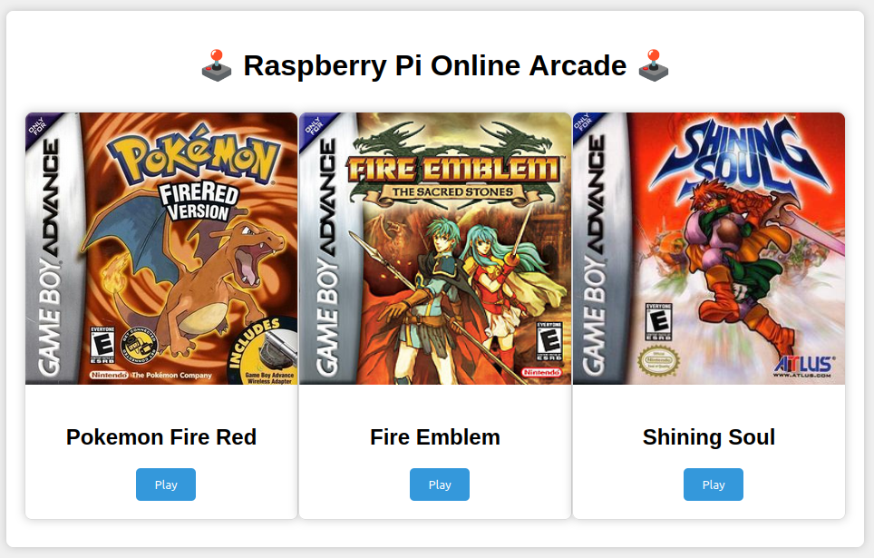
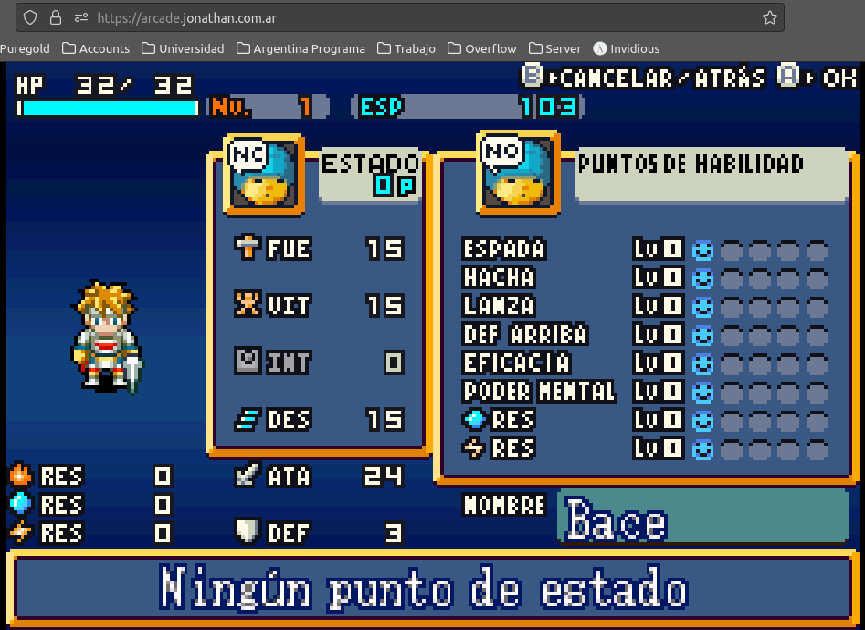
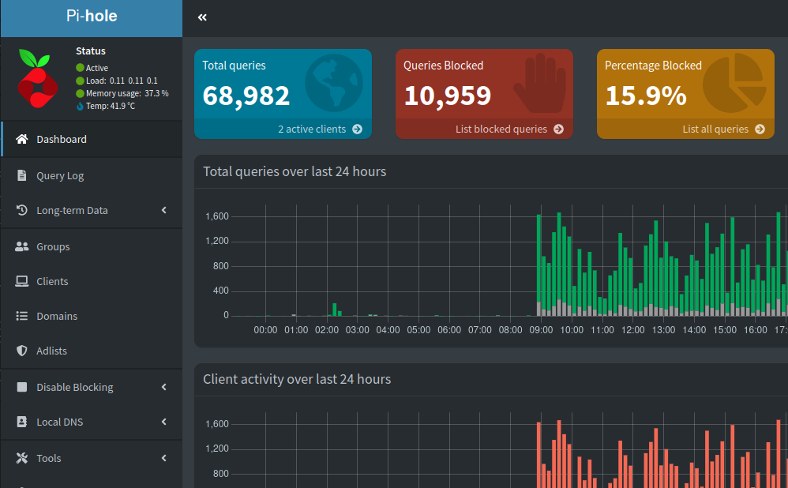

# Local Server


[](https://app.codacy.com/gh/jd-apprentice/jd-server/dashboard?utm_source=gh&utm_medium=referral&utm_content=&utm_campaign=Badge_grade)

Basic Network Diagram


Complete Network Diagram


# Table of Contents 🏠

- [Blogs 📖](#blogs-)
- [Cloudflare 🌩](#cloudflare-)
    - [Zero Trust 🌐](#zero-trust-)
- [Demos 📺](#demos-)
    - [Portfolio 📄](#portfolio-)
    - [Links 🔗](#links-)
    - [Arcade 🕹](#arcade-)
        - [Gameplay 🕹](#gameplay-)
    - [PiHole 🕳](#pihole-)
    - [TheLounge 💬](#irc-client-)
    - [Status Page 🗽](#status-page-)
    - [Shared Server 📡](#shared-server-)
    - [Terminal Web SSH 🌐](#terminal-web-ssh-)
    - [Docker Logs 📜](#docker-logs-)
    - [Backup 📦](#backup-)
- [Available Hardware 🖥](#available-hardware-)
- [Random stuff 🎉](#random-stuff-)
- [Project Track 🛤](#track-)
- [Folder Structure 📁](#folder-structure-)

## Blogs 📖

- Build your own homelab [here](https://blog.jonathan.com.ar/build-your-own-homelab-with-a-raspberry-pi-zero-2-w-and-cloudflare-zero-trust)
- Use SSH on the web [here](https://blog.jonathan.com.ar/access-your-homelab-with-ssh-from-the-browser-with-cloudflare)

## Cloudflare 🌩


Here is some of the services that I use from cloudflare

- [Zero Trust](https://www.cloudflare.com/zerotrust/)
- [DNS](https://www.cloudflare.com/dns/)
- [Email](https://www.cloudflare.com/developer-platform/email-routing/)

### Zero Trust 🌐

Zero Trust is a security model that requires strict identity verification for every person and device trying to access resources on a private network, regardless of whether they are sitting within or outside of the network perimeter.


Under settings what I have changed?

| Option | Section | Value | Default |
| --- | --- | --- | --- |
| Settings | Networking | Firewall Proxy | Off |
| Settings | Authentication | One-Time Pin | Not Set |
| Settings | Warp Client | Warp Client Checks | Not Set |

## Demos 📺

### Portfolio 📄

A simple portfolio made with http-server, like nginx autoindex but made with nodejs.



### Links 🔗

Website that contains all the links to my services and social media.


### Arcade 🕹

Arcade online for self hosted games, made with Nostalgist.

For the game itself this is the repo [arcade](https://github.com/jd-apprentice/-Arcade-Online-)




### Gameplay 🕹

https://github.com/jd-apprentice/jd-server/assets/68082746/00fbb0d2-e05d-4913-b20a-b2d3f0a9e939

### PiHole 🕳

PiHole is a DNS sinkhole that blocks ads on the network level.



### IRC Client 💬

Thelounge is a IRC client for the web


### Status Page 🗽

Uptime kuma for status in my own services


### Shared Server 📡

This is a folder that can be written in the webserver, for personal usage with friends, it has one time pin with cloudflare before the user can access the folder.


### Terminal Web SSH 🌐

Terminal web ssh is a web ssh client that can be used to access the server from the browser.
It is protected and only devices conected from WARP can access it, also it contains a one time pin.


### Docker Logs 📜

Since i'm running everything inside containers, I'll use Dozzle to see the logs of the containers.


### Backup 📦 Alerts 🚨 Monitoring 📊

Mannually backup the server with a cronjob and bash.
Alerts for the cloudflare tunnel with a cronjob as well.
Monitor cpu, ram, disk usage with a cronjob too.

Cron jobs are under /etc/cron.<time>


## Available hardware 🖥

- Raspberry Pi Zero 2 W
    - 4 Cores (ARMV7) 512MB RAM 16GB MicroSD

- TV Box 4 Cores (ARM) 2GB RAM
    - 16GB MicroSD

- 240GB SSD
- 500 Watts Generic PSU
- Untested 2GB DDR3
- Untested A8 7650K
- Untested 500GB HDD

#### Random stuff 🎉

- Notebook Celeron N4002 2 Cores 4GB DDR4 240GB SSD
- Notebook R5 5500U 6/12 Cores 8GB DDR4 500GB SSD

## Track 🛤

- Project tracking is being made [Here](https://github.com/users/jd-apprentice/projects/4/views/1)

## Folder structure 📁

```
🌳 jd-server/
┣ 📁 assets/
┃ ┣ 📄 game.png
┃ ┣ 📄 page.png
┃ ┣ 📄 pihole.png
┃ ┗ 📄 portfolio.png
┣ 📁 docker/
┃ ┣ 📄 arcade.Dockerfile
┃ ┣ 📄 portfolio.Dockerfile
┃ ┗ 📄 server.compose.yml
┣ 📁 docs/
┃ ┣ 📁 networking/
┃ ┃ ┣ 📄 Basic Approach.excalidraw
┃ ┃ ┣ 📄 Basic_Approach.png
┃ ┃ ┣ 📄 Network_JD_2.excalidraw
┃ ┃ ┣ 📄 README.md
┃ ┃ ┗ 📄 V1.1.png
┃ ┣ 📄 android.md
┃ ┗ 📄 arch.md
┣ 📁 portfolio/
┃ ┣ 📄 Jonathan_Dyallo_2023_Devops_Eng.pdf
┃ ┗ 📄 homelab.txt
┣ 📁 scripts/
┃ ┗ 📄 ventoy.sh
┣ 📄 .gitignore
┗ 📄 README.md
```
