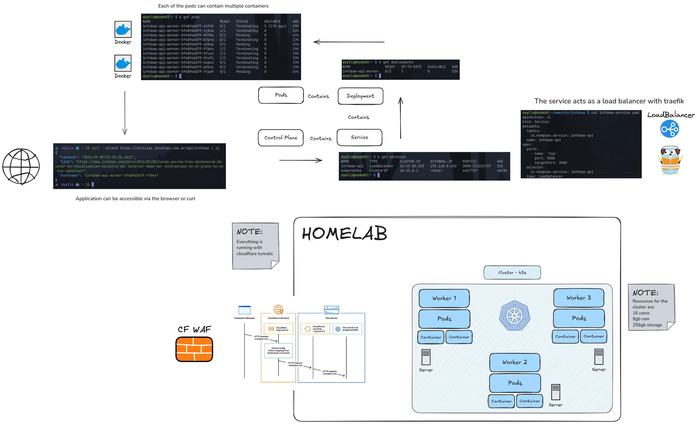

# Homelab

Need help building your homelab? Find me [here](https://jonathan.com.ar)

## 🧑‍🔬 Project Progress

You can check how everything is going in the [project board](https://github.com/users/jd-apprentice/projects/4/views/1)

## 🧰 Documentation

Work in progress

## 📚 Wiki

Work in progress