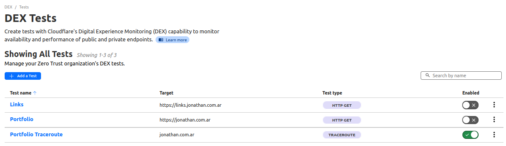
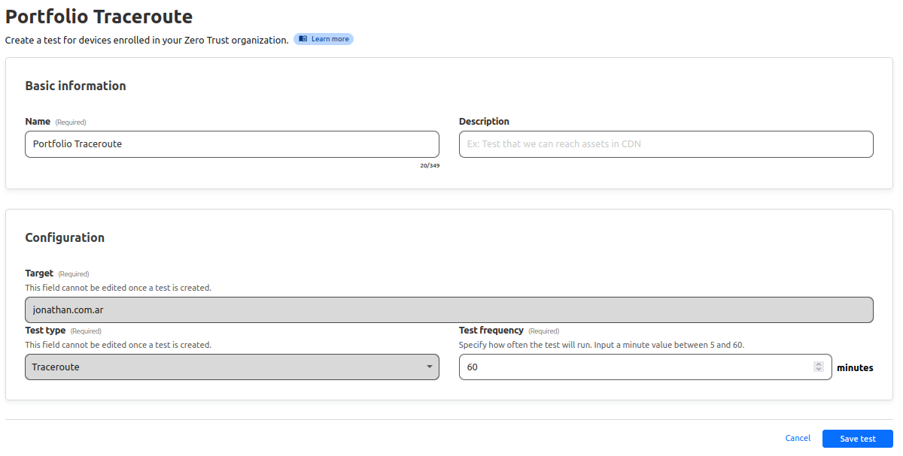
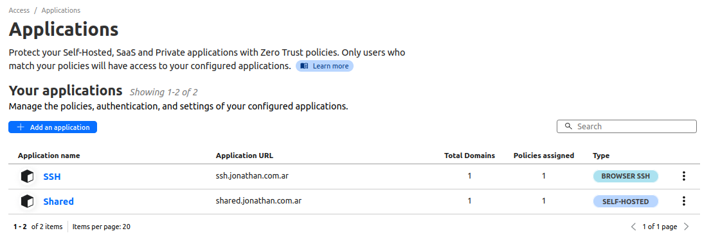
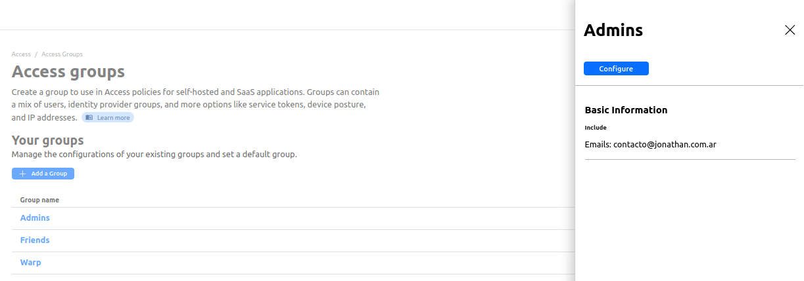
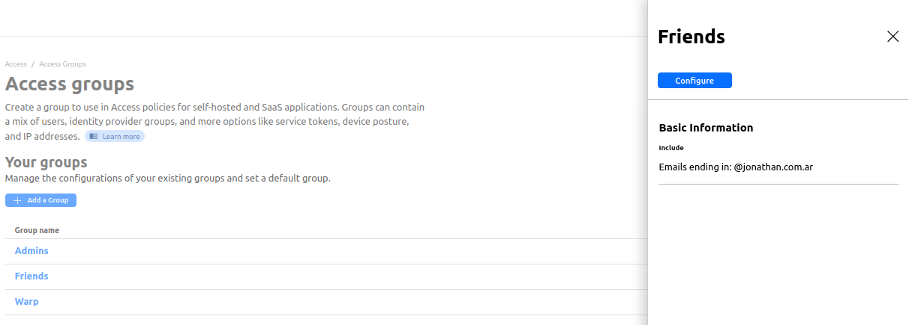
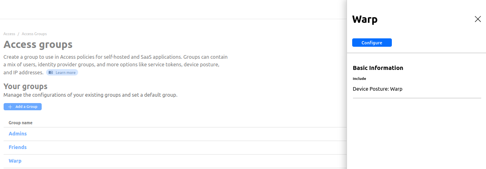

# Zero Trust 0️⃣

## DEX Tests 🧪

These are not working




## Access 🚪

- Applications



- Access Groups

Admins



Friends



Warp



# Security 🔒

## Firewall 🛡️

Custom Rules

```bash
# Block non-HTTP/S traffic
not cf.edge.server_port in {80 443}
```

```bash
# Block PHP, XML, and WordPress
(lower(http.request.uri.path) contains "wp-")
or (lower(http.request.uri.path) contains ".php")
or (lower(http.request.uri.path) contains ".xml")
```