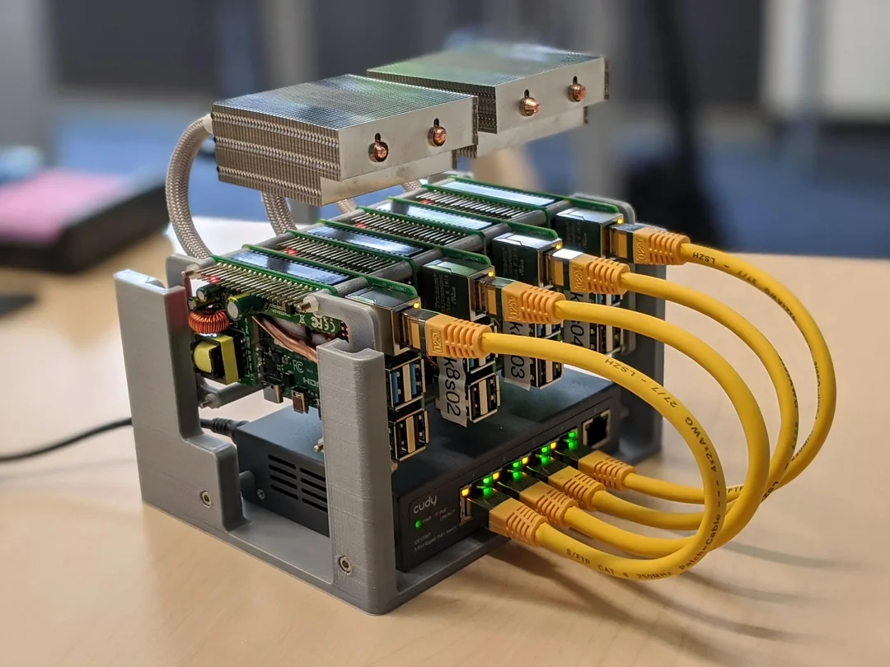
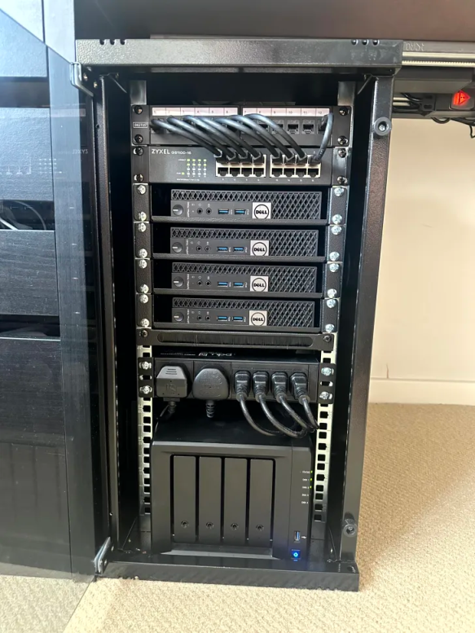
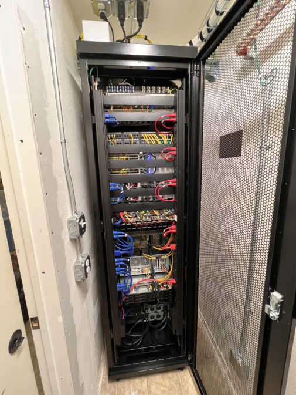

# Cómo un Homelab puede impulsar tu carrera

Veni a ver lo mucho que se puede aprender con un Homelab, desde tu espacio de networking para quedarte sin salida a internet mientras intentas segmentar trafico por VLANs, hasta tu cluster de kubernetes totalmente overkill para una api que solo usan tus amigos, nadie va a poder criticar tu sobreingenieria, o bueno si pero no pasa nada.

## ¿Que es un Homelab?

Un Homelab es un espacio personal utilizado para crear y experimentar nuevos conocimientos, teniendo el control total de los mismos, desde L1 hasta L7.

Tenemos labs chiquitos

Algunos no tan chiquitos

Y bueno tenemos otros

Creditos de las imagenes a sus creadores en https://www.reddit.com/r/homelab

## ¿Que propositos les podemos dar?

- Redes
- Infraestructura
- Seguridad
- Desarrollo
- Investigacion
- Etc

## ¿Existen casos reales donde lo que hago en casa lo puedo aplicar en el trabajo?

Tengo un caso en particular donde tuve que desplegar y disponibilizar a los desarrolladores una base de datos nueva, para la misma tenia que ponerme en comunicacion con el equipo de arquitectura, redes y dba. Como era algo que necesitaba muchas validaciones, arme una solucion de punta a punta en mi lab, donde lo hice andar de la forma que me parecia optima para el tiempo que teniamos, la presente se aprobo y solo tuvieron que generarme/configurarme los recursos solicitados, podia recibir estos recursos desde el mismo trabajo? Si, pero burocraticamente tomaba mucho mas tiempo.